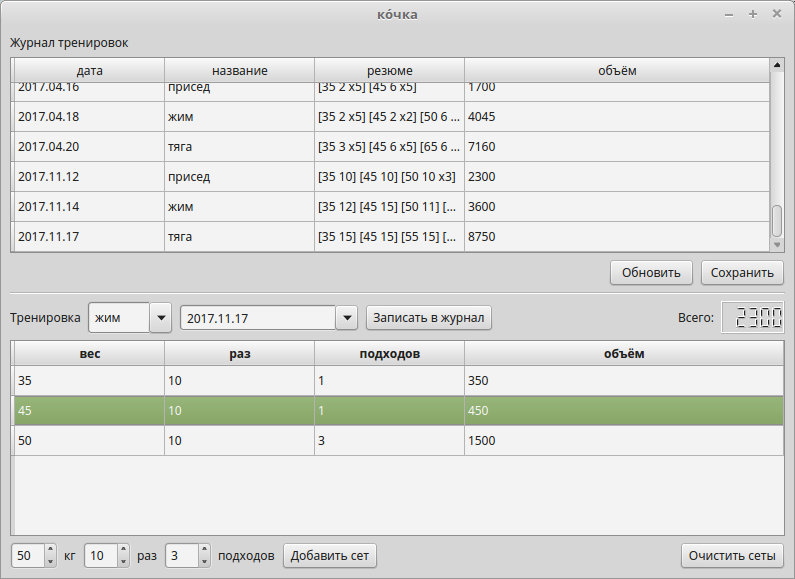

# Ко́чка
Журнал тренировок / Training log



Программа позволяет вести журнал тренировок в работе с весами. В журнале
фиксируется тренировка на определенное упражнение (тяга, жим, присед, ...).
В тренировку входят сеты, то есть подходы, в свою очередь состоящие из веса и
количества повторений. Можно задать и количество подходов.

Программа написана для личных целей, не претендует на полноту и правильность
использования Qt, но претендует на пример кода автора на языке Python. На
первую, рабочую версию было затрачено около недели.

You be able to log your trainings with this program. You can log exercises such
as deadlift, bench press, squat etc. Exercise consists of sets. Each set is
weight and number of repetitions. Also you can set number of sets.

The program has been wrote for personal purpose. It not show Qt knowledge but is
used as example of the author's Python code. The program has been wrote during
a week.

## Запуск / Run
```sh
python3 main.py
```

## Зависимости / Requirements
PyQt4

## Todo
- edit exercises
- edit sets
- analysis of data with diagrams


- Internationalization
- Threading for loading and save data
